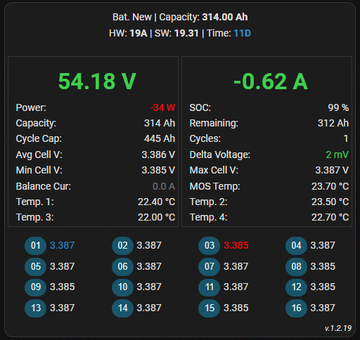
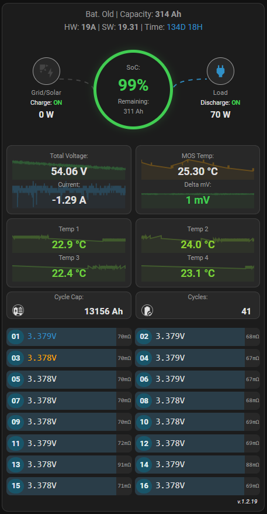
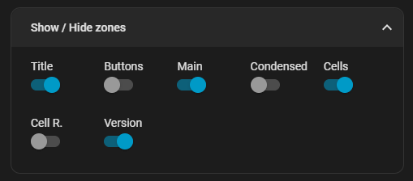

I liked the layout of [Inspiration](https://github.com/syssi/esphome-jk-bms/discussions/230), but wanted the native functionality of clicking on an entity to see the history. So I created this simplistic card

# Layouts
## Default

**Visual Logic:**
The flowline animation is exclusive to the Default Layout and triggers dynamically when the balancing current sensor reports a non-zero value. This provides a real-time visual representation of the active balancing process.

***Note on Visualization:***
*To showcase the flowline animation in the GIF above, the BMS parameters were temporarily adjusted (e.g., `balance starting voltage` at 3.380V and `balance trigger voltage` at 0.003V). These settings ensure the balancing state is active for demonstration purposes.*

## Core Reactor

inspired from: https://github.com/syssi/esphome-jk-bms/discussions/230
integration from: https://github.com/syssi/esphome-jk-bms/tree/main

## Prefix:
if your entities start with **jk_bms**_total_voltage, your prefix will be **jk_bms**

## Show / Hide zones:

The control features a highly flexible interface divided into distinct functional zones. Users can toggle the visibility of specific elements — including the Title, Main Content, Cells, Cells Resistance, and other — to create a tailored viewing experience that suits their workflow.

### Hacs custom repository
1. Inside hacs, click on the top right burger menu
   
2. Add the repository url, and select dashboard as type
   

### Manual Installation

1. Create a new directory under `www` and name it `jk-bms-card` e.g `www/jk-bms-card/`.
2. Copy the `jk-bms-card.js` into the directory.
3. Add the resource to your Dashboard. You can append the filename with a `?ver=x` and increment x each time you download a new version to force a reload and avoid using a cached version. It is also a good idea to clear your browser cache.

PR's are welcomed. 